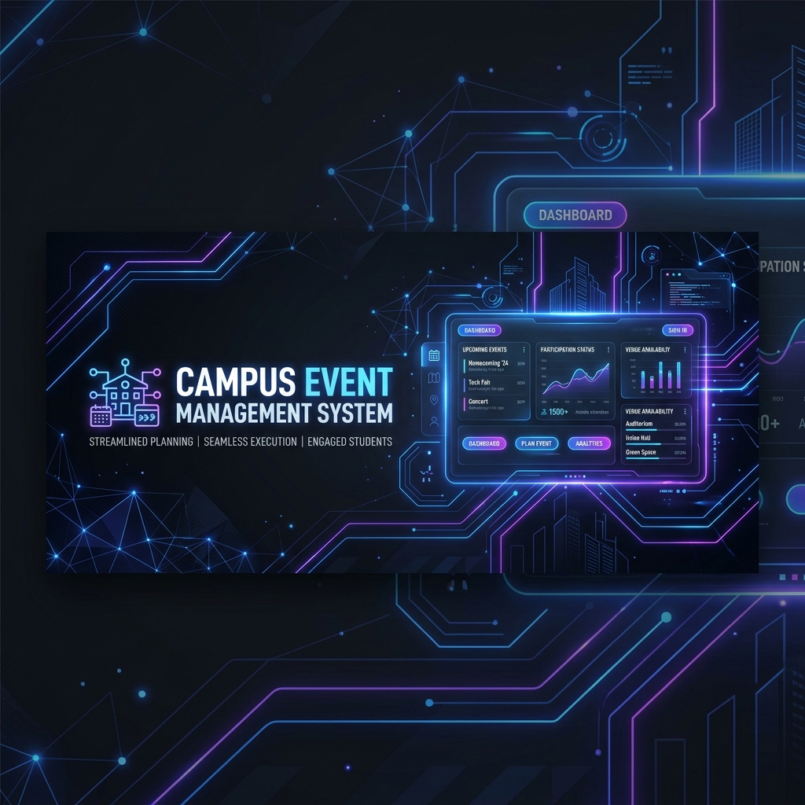
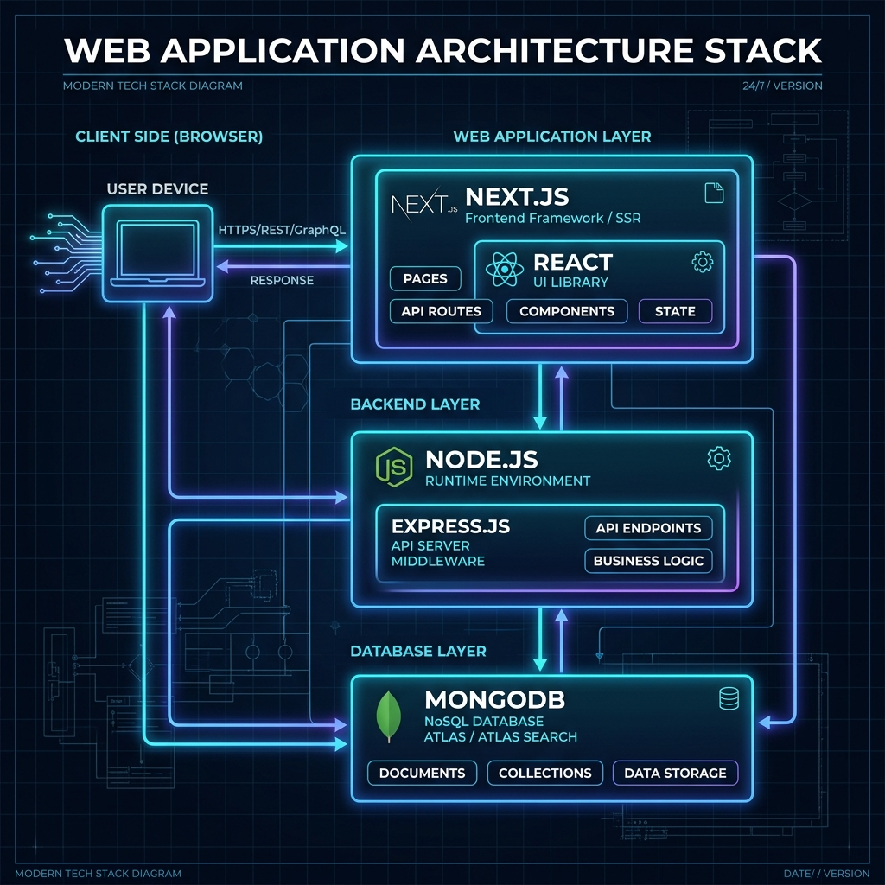
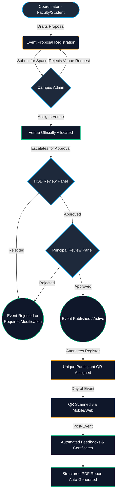

# CEMS: Campus Event Management System
## Technical Project Report & Comprehensive Documentation

### 1. Executive Summary
**CEMS (Campus Event Management System)** is a comprehensive, enterprise-grade, role-based web application designed to streamline the planning, allocation, approval, and execution of events within educational institutions. The platform centralizes the entire event lifecycle management, replacing disparate manual processes with a unified, digital workflow that guarantees accountability, transparency, and operational efficiency.

The system incorporates robust features such as multi-tier approval matrixes, conflict-free venue allocation, dynamic automated generation of media assets (posters, certificates, PDF reports), and real-time attendance tracking via QR Code scanning. 

### 2. High-Level Technical Architecture
CEMS is engineered as a modern full-stack web application leveraging the **Next.js App Router** for advanced server-side rendering, streaming, and optimized static site generation.

#### 2.1 System Components
- **Frontend Layer**: Built exclusively with **React 19** using Server and Client components. It features heavily optimized, responsive interfaces styled with **Tailwind CSS**. **Radix UI** primitives provide accessible foundation components, augmented with **Framer Motion** for fluid layout transitions and micro-interactions.
- **Backend Layer (BFF - Backend for Frontend)**: Next.js API Routes and Server Actions encapsulate business logic, robust form validations, secure database executions, and integrations with external automated APIs (e.g., APITemplate.io).
- **Data Access Layer**: **Mongoose ODM** sits atop a **MongoDB** NoSQL database cluster. The NoSQL strategy is chosen to efficiently model deeply nested and interconnected documents, particularly the hierarchical schemas required for Events, Feedbacks, and User Metadata.
- **Identity & Access Management (IAM)**: Utilizes **NextAuth.js (v5 Beta)** to deliver stateless, deeply integrated, session-backed authentication. Strong Role-Based Access Control (RBAC) middleware guarantees route protection and authorized mutation capabilities.

### 3. Event Lifecycle Workflow
The backbone of CEMS is its structured event processing workflow.

### 4. Deep Dive into System Features 

#### 4.1 Granular Role-Based Access Control (RBAC)
The logical flows are segmented by strict authorization criteria enforced both at the UI layer and API/Server Action layers.
- **Event Coordinators (Faculty/Students)**: Handle the creation of event drafts, assignment of dynamic institutional budget categories, QR code tracking triggers, and initiating the distribution of post-event certificates.
- **Department Heads (HOD) & Principals**: Operate the multi-tier approval matrix. Able to scrutinize detailed event budgets, proposals, and provide irreversible or conditionally modifiable rejection statuses.
- **Campus Admins**: Oversee venue availability, preventing spatial/temporal overlaps during complex scheduling procedures.

#### 4.2 Dynamic Media Generation Engine
A core technical accomplishment of CEMS is its robust generation pipeline which executes entirely absent of human intervention, once configured:
- **PDF Generation via `jsPDF`**: Comprehensive post-event reports are generated on the client-side utilizing `jspdf` and `jspdf-autotable`. These documents dynamically inject event metadata, statistical tables, financial summaries, downloaded posters, and a gallery of up to 8 uploaded images into a standard institutional template.
- **Bespoke Certificate Engine**: Scalable generation of attendee certificates uses native SVGs containing dynamic elements (names, data, signatures) converted via `sharp` and buffered through Next.js optimized routes. The placement of the name dynamically maps securely across high-resolution image assets without layout degradation. 
- **Automated Posters**: Leveraging external endpoints such as `APITemplate.io` and utilizing predetermined base assets (e.g. `poster-1.jpeg`) to provide instant marketing collateral upon event initialization.

#### 4.3 Integrated QR Code Attendance Processing
- **Cryptographic Assignment**: Integrates `qrcode` and `next-qrcode` to bind registrant hashes to visual data payloads.
- **Hardware-Agnostic Scanning**: Leverages `html5-qrcode` on the client, transforming standard browser interfaces into performant barcode/QR scanners capable of tracking real-time influxes of participants without dedicated scanning hardware.

### 5. Detailed Technology Stack Specifications
- **Framework Ecosystem**: `Next.js 16.1+` (App Router Paradigm)
  - Leverages React Server Components for minimizing client bundle sizes while ensuring SEO compliance.
  - Implements Optimistic UI principles utilizing `Server Actions` alongside `revalidatePath` and `revalidateTag` for instantaneous mutations.
- **TypeScript**: Enforces rigorous static boundary type validation between the MongoDB abstractions, the BFF layer, and the React props.
- **Database Architecture**: `MongoDB` & `Mongoose`
  - Leverages Document-Oriented mechanisms to allow dynamic schema designs (e.g., varied Institutional Budget Categories or dynamic feedback schemas). 
- **Security & Authorization**: `Auth.js v5` (NextAuth)
  - Leverages strong stateless JWT logic layered over bcrypt-hashed credential databases. Middleware checks ensure sub-ms rejection of unauthorized routing.
- **UI Architecture**: `Tailwind CSS`, `clsx`, `cva`, `tailwind-merge`
  - Employs utility-first methodology to minimize bloated cascading stylesheet interactions. Employs `shadcn/ui` logic patterns for headless accessible primitives.
- **Data Engineering Utilities**:
  - `date-fns`: Critical calculation library powering the complex Timeline visuals and venue booking cross-validation constraints.

### 6. Future Horizons & Versioning
CEMS continues iterative agile expansion. Recent paradigm shifts include advanced physical caching for image payloads, decoupling student and faculty management workflows, expanding automated document configurations, and perfecting irreversible "soft-delete" methodologies for unapproved historical records. Future iterations aim to integrate predictive AI algorithms to detect optimal venue utilization.
